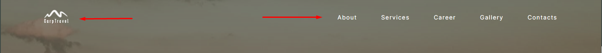
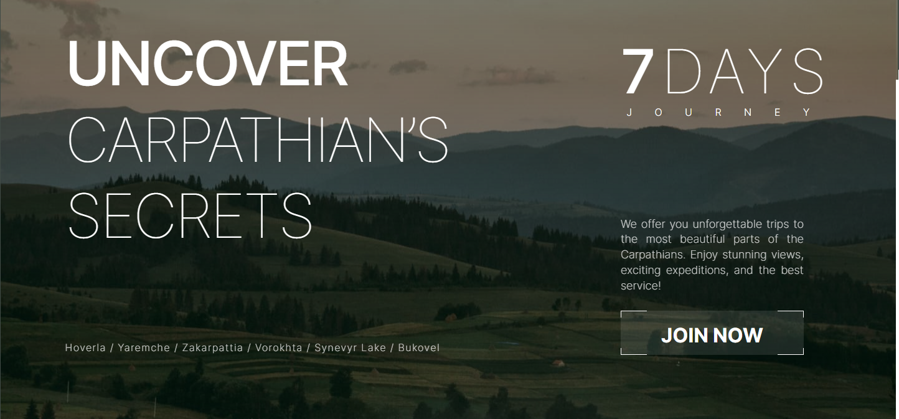
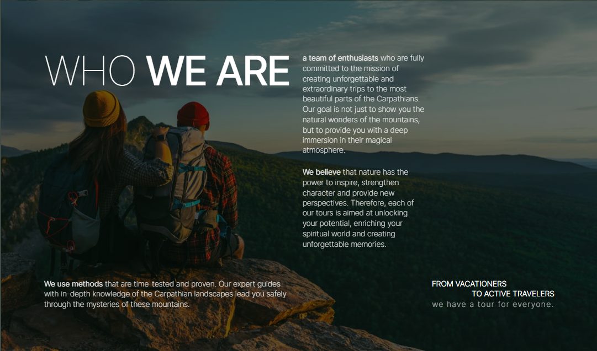
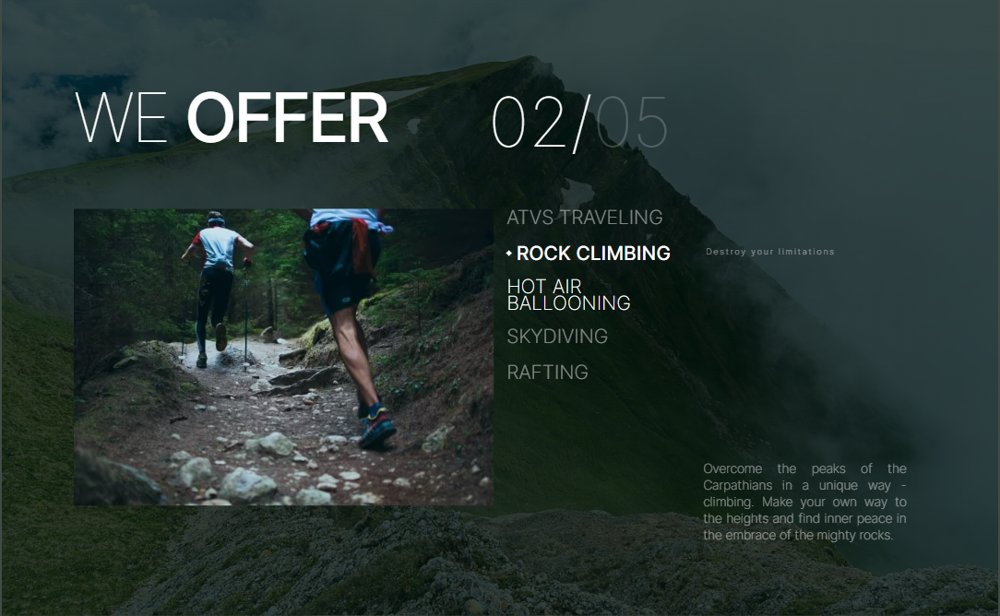
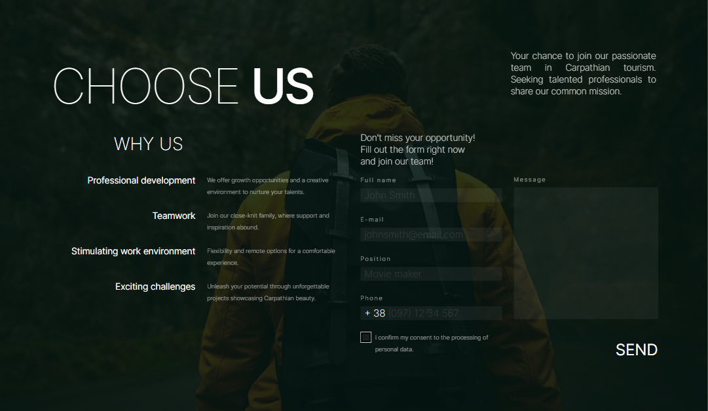
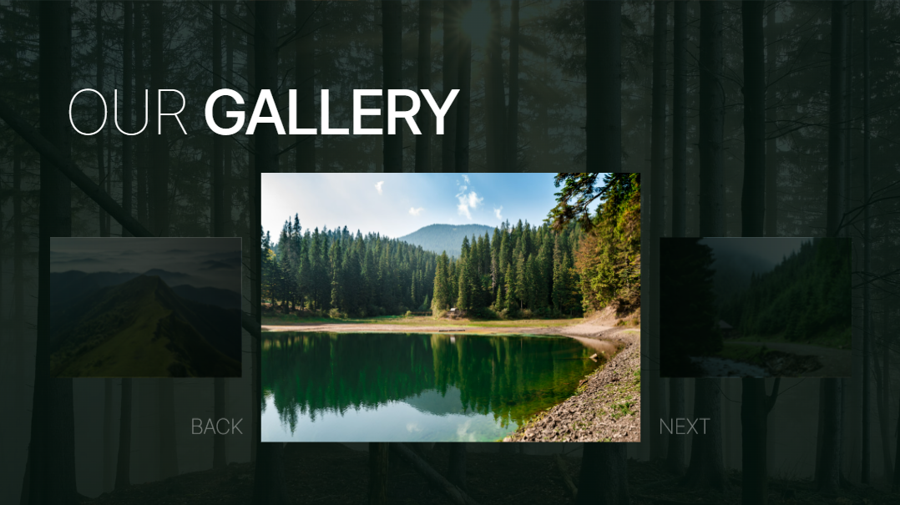
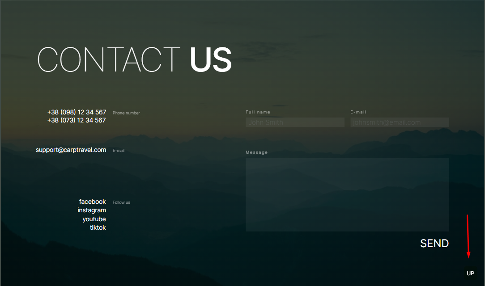

# CarpTravel app

Застосунок призначений для фанатів екстримального відпочинку у гірській
місцевості українських Карпат. Пристуній вибір різних видів розваг та відповідні
фото. Є можливість заповнити контактні форми для зворотнього зв`язку.

Цей проект було створено за допомогою Next.js, Tailwind, TypeScript. Також
пристуній адаптив для мобільних пристроїв.

Design:
https://www.figma.com/file/2nHaXyrwQxqXLYmPUGQuP1/CarpTravel---%D0%A2%D0%B5%D1%81%D1%82%D0%BE%D0%B2%D0%B5-%D0%B7%D0%B0%D0%B2%D0%B4%D0%B0%D0%BD%D0%BD%D1%8F?type=design&node-id=348-14&mode=design&t=tYgphzvUaoUTEJw5-0

## 0. Common

Загалом застосунок містить 7 загальних секцій.

## 1. Header section

Ця секція складається із логотипу компанії та головного меню навігації. Для
переміщення по застосунку необхідно використовувати посилання на відповідні
секції у хедері або у мобільному меню. Плавне прокручування сторінки до
відповідної секції відбувається завдяки використанню бібліотеки react-scroll.

## 2. Hero section

Секція герой містить основний заголовок застосунку із закликом дослідити та
відкрити секрети українських карпатських гір. Також тут доступний перелік
локацій де можна отримати послуги. За допомогою посилання "Join Now"
відбувається плавне переміщення до секції контактів.

## 3. About section

Тут розміщена основна інформація про компанію, яка складається із заголовку та
опису.

## 4. Services section

Інформація про доступні послуги компанії, їх опис та фото із відповідним
закликом. Складається із 5 слайдів із змінним фото виду відпочинку та фону.
Слайдер реалізовано за допомогою бібліотеки Swiper.

## 5. Career section

Секція складається із двох частин: списку переваг та контактної форми. Контактна
форма створена за допомого react-hook-form та забезпечена жива валідація.
Відправка форми недоступна коли присутні помилки валідації полів форми. Успішне
відправлення форми показується нотифікацією у верхньому куті екрану реалізованою
завдяки react-hot-toast. Значення полів форми зберігається у localStorage.

## 6. Gallery section

Галерея із фото можливих місць відпочинку замовників відпочинку. Безкінечний
слайдер реалізований через Swiper. Зміна слайдів через перетягування зображення
або використання відповідних кнопок prev/next. Активний слайд має більший
розмір, а суміжні затемнені.

## 7. Contacts section

Секція контаків складається із блоку контактних посилань, блоку посилань на
соціальні мережі та контактної форми. Реалізація форми аналогічна із формою
секції 5.Значення полів форми зберігається у localStorage.

Також присутня кнопка "UP" для переміщення до початку додатку. Реалізована через
бібліотеку react-scroll-to-top.

